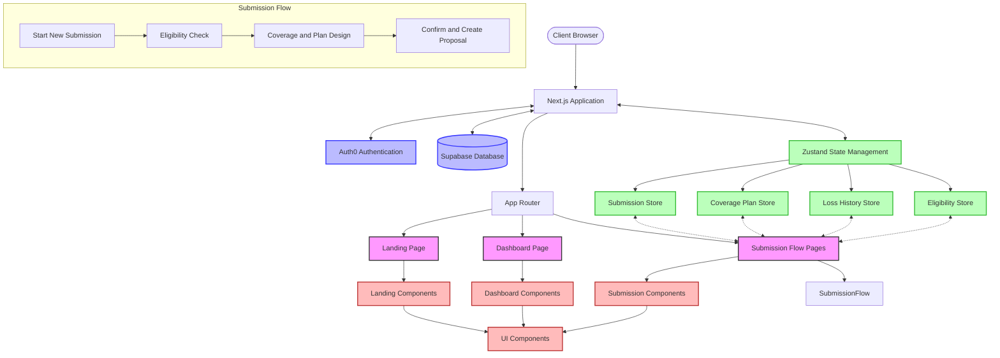
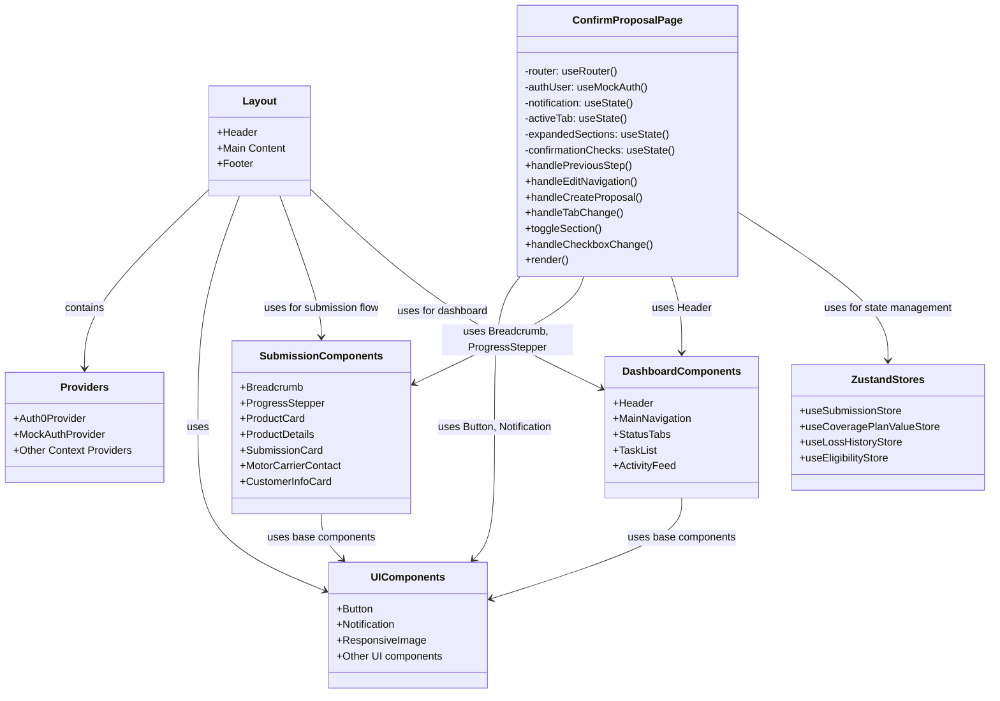
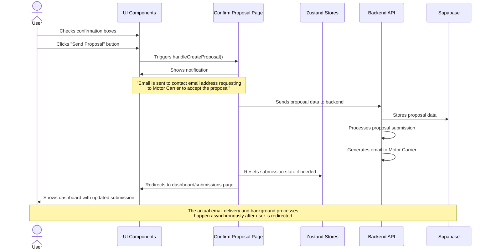

# AHP3 System Architecture Documentation

This document provides a comprehensive view of the AHP3 Next.js application architecture from multiple perspectives.

## Table of Contents

1. [System Overview](#system-overview)
2. [Component Architecture](#component-architecture)
3. [System Interactions](#system-interactions)
4. [Feature Implementations](#feature-implementations)
   - [Send Proposal Feature](#send-proposal-feature)
5. [Technical Stack](#technical-stack)
6. [Development Patterns](#development-patterns)
7. [Diagrams](#diagrams)
   - [System Architecture Diagram](#system-architecture-diagram)
   - [Component Structure Diagram](#component-structure-diagram)
   - [Send Proposal Sequence Diagram](#send-proposal-sequence-diagram)

## System Overview

AHP3 is a Next.js-based web application designed for insurance submission and proposals. The system follows a modern React architecture with Next.js 13+ App Router, client-side state management using Zustand, and external services integration including Auth0 for authentication and Supabase for database storage.

The application enables users to:
- Create insurance submissions
- Navigate through a multi-step qualification process
- Configure coverage plans
- Generate and send proposals to motor carriers
- Track submission status through a dashboard

## Component Architecture

The application uses a component-based architecture with several layers:

### UI Layer
- **UI Components**: Reusable, presentational components (buttons, notifications, forms)
- **Domain Components**: Business-domain specific components grouped by function:
  - Submission-related components
  - Dashboard-related components
  - Landing page components

### Page Layer
- Next.js page components representing routes in the application
- Responsible for layout, data fetching, and composing domain components

### State Management Layer
- Zustand stores organized by domain:
  - Submission Store
  - Coverage Plan Store 
  - Loss History Store
  - Eligibility Store
- Local React state for UI-specific concerns

### Service Layer
- Authentication services (Auth0)
- Data persistence services (Supabase)
- API integrations

## System Interactions

The application primarily follows a client-side rendering model with persistent local state:

1. **Authentication Flow**:
   - User authenticates via Auth0
   - JWT tokens are managed by Auth0 SDK
   - Protected routes check authentication status

2. **Data Persistence**:
   - User session data persists in browser localStorage via Zustand persist middleware
   - Server data is synchronized with Supabase as needed
   - Form state is maintained across navigation

3. **Submission Workflow**:
   - Step-by-step wizard pattern guides users through submission process
   - Each step has validation before proceeding
   - Form data is collected and aggregated in stores
   - Final submission creates proposal and notifies motor carrier

## Feature Implementations

### Send Proposal Feature

The Send Proposal feature is implemented in the Confirm Proposal Page with the following components:

1. **UI Components**:
   - Confirmation checkboxes for user agreement
   - Send Proposal button (conditionally enabled)
   - Notification component for user feedback

2. **Workflow**:
   - User reviews proposal details across multiple tabs
   - User checks confirmation boxes
   - User clicks Send Proposal button when enabled
   - System displays notification confirming email was sent
   - System redirects to dashboard after brief delay

3. **Code Implementation**:
   - `handleCreateProposal` function manages the submission process
   - Notification state is updated to show success message
   - Timeout function manages delayed redirect
   - Next.js router handles navigation to dashboard

## Technical Stack

- **Frontend Framework**: Next.js 13+ with App Router
- **UI Library**: React
- **State Management**: Zustand with persist middleware
- **Styling**: Tailwind CSS
- **Authentication**: Auth0
- **Database**: Supabase
- **Type Safety**: TypeScript
- **Testing**: Jest and React Testing Library

## Development Patterns

The application implements several key development patterns:

1. **Custom Hooks Pattern**:
   - Domain-specific hooks encapsulate business logic
   - Zustand store hooks provide centralized state access

2. **Component Composition Pattern**:
   - Small, reusable UI components composed into larger features
   - Clear separation between UI and container components

3. **Multi-Step Form Pattern**:
   - Progressive disclosure of form fields
   - State persistence between steps
   - Validation at each step

4. **Notification Pattern**:
   - Centralized notification system
   - Temporary, non-intrusive user feedback
   - Automatic dismissal with manual override

5. **Progressive Enhancement**:
   - Core functionality works without JavaScript
   - Enhanced experience with client-side interactions

## Diagrams

### System Architecture Diagram

### Component Structure Diagram

### Send Proposal Sequence Diagram

## Conclusion

The AHP3 application demonstrates a modern, component-based architecture that leverages Next.js, Zustand, and external services to create a robust insurance submission platform. The architecture prioritizes:

1. **User Experience**: Multi-step form with persistent state and clear navigation
2. **Code Organization**: Logical separation of concerns across components and stores
3. **Maintainability**: Reusable components and centralized state management
4. **Extensibility**: Clean abstractions that allow for adding new features

This architecture enables rapid development of new features while maintaining a clean and maintainable codebase.
