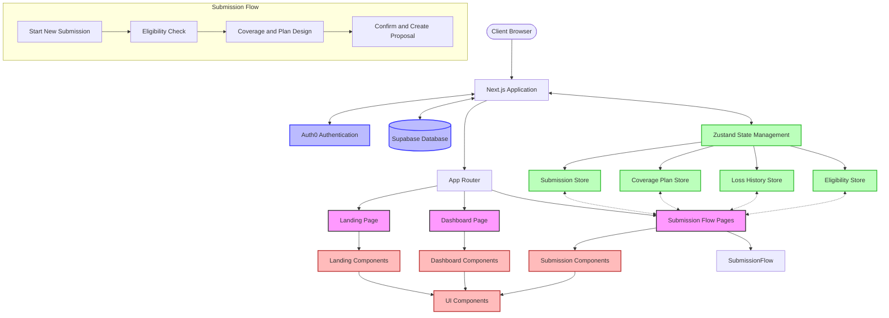

# AHP3 Next.js Application Architecture

## Architecture Components Explanation

### Client-Side
- **Browser Client**: End-user interface accessing the application

### Next.js Framework
- **App Router**: Next.js 13+ App Router structure for routing and page organization
- **Pages**: Main sections of the application (Landing, Dashboard, Submission flow)

### Authentication & Database
- **Auth0**: Handles user authentication and authorization
- **Supabase**: Provides database services for storing application data

### State Management
- **Zustand**: Client-side state management library with persistence
- **Stores**:
  - **Submission Store**: Manages submission flow state (DOT info, carrier details, products)
  - **Coverage Plan Store**: Manages coverage plan configuration
  - **Loss History Store**: Manages loss history information
  - **Eligibility Store**: Manages eligibility criteria and validation

### Component Structure
- **UI Components**: Common UI elements like buttons, notifications, forms
- **Domain-Specific Components**:
  - **Landing Components**: Homepage elements
  - **Dashboard Components**: User dashboard elements
  - **Submission Components**: Insurance submission flow components

### Submission Flow
- 4-step process:
  1. **Start New Submission**: Initial carrier and product selection
  2. **Eligibility**: Qualification check for insurance products
  3. **Coverage and Plan Design**: Configure coverage details
  4. **Confirm and Create Proposal**: Review and submit insurance proposal

## Data Flow

1. User authenticates via Auth0
2. Application loads initial state from local storage (persisted Zustand stores)
3. User navigates through the submission flow
4. Each step updates the relevant stores
5. Data is persisted to local storage and synchronized with Supabase as needed
6. On proposal submission, data is sent to backend services
7. Notification system provides feedback on operations (success/error)

## Technical Features

- **Client-side state persistence** using Zustand's persist middleware
- **Form validation** at each step of the submission flow
- **UI component library** for consistent design
- **Responsive design** for all device types
- **Progressive form completion** with ability to save and resume
- **Multi-step wizard pattern** for complex form submission
