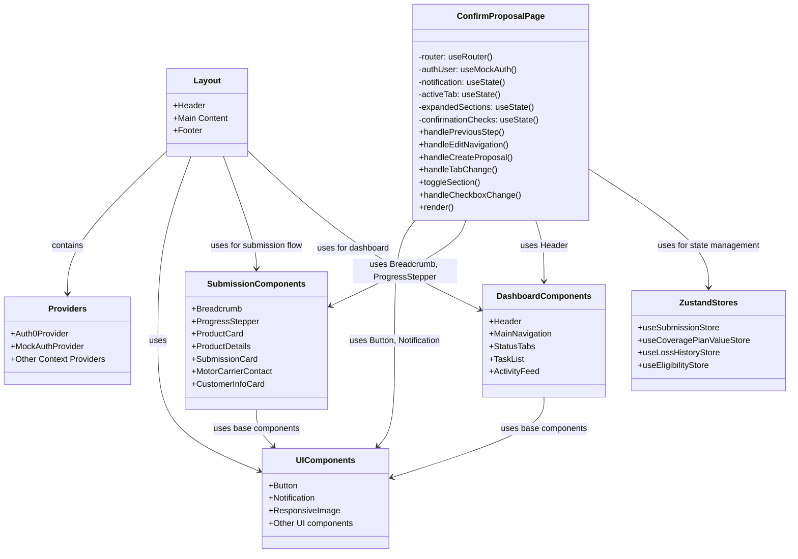

# AHP3 UI Component Structure

## UI Component Hierarchy

### Layout
- **App Layout**: The main layout wrapper that includes header, main content area, and footer
- **Auth Providers**: Wraps the application with authentication context

### Shared UI Components
- **Button**: Reusable button component with different variants (primary, outline, text)
- **Notification**: Toast-style notification component for feedback messages
- **ResponsiveImage**: Image component with responsive behavior
- **Other UI Elements**: Form inputs, modals, cards, etc.

### Domain-Specific Components
- **Submission Components**: 
  - **Breadcrumb**: Navigation breadcrumb showing current position in flow
  - **ProgressStepper**: Sidebar showing all steps in submission process
  - **ProductCard/Details**: Components for displaying insurance products
  - **MotorCarrierContact**: Form for motor carrier contact information
  
- **Dashboard Components**:
  - **Header**: Dashboard-specific header with user info
  - **MainNavigation**: Primary navigation for dashboard
  - **StatusTabs**: Tabs for filtering dashboard content
  - **TaskList/ActivityFeed**: Components for displaying user tasks and activity

### Page Components
- **ConfirmProposalPage**: Specific page for reviewing and confirming proposals
  - Manages local UI state (active tab, accordions, checkboxes)
  - Handles form submission and notification display
  - Coordinates with global state via Zustand stores

## Component Communication

### State Management
- **Local State**: React useState hooks for UI-specific state
- **Global State**: Zustand stores for cross-component state
- **URL State**: Next.js router for navigation state

### Data Flow
1. Stores provide data to components
2. Components render based on store data
3. User interactions trigger component methods
4. Component methods update local state or call store actions
5. Store actions update global state
6. Components re-render with updated state

### Event Handling
- **Form Submission**: handleCreateProposal in ConfirmProposalPage
- **Navigation**: Next.js router's push method
- **UI Interactions**: Tab changes, accordion toggles, checkbox updates

## Focus on Confirm Proposal Page

The ConfirmProposalPage is the final step in the submission flow, where users:

1. Review submission details across multiple tabs (recap, quote, proposal)
2. Confirm acknowledgments via checkboxes
3. Submit the proposal via the SendProposal button
4. Receive notification feedback
5. Get redirected to the dashboard

This page demonstrates the complete component architecture working together:
- UI components for display and interaction
- Local state for UI behavior
- Global state for business data
- Navigation for workflow progression
- Notification for user feedback
