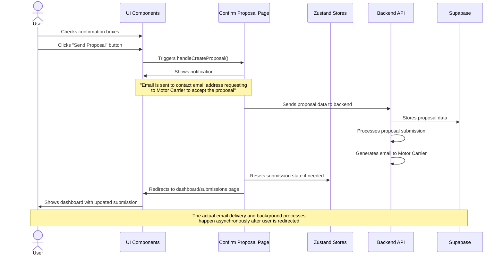

# AHP3 Send Proposal Flow Sequence Diagram

## Proposal Submission Process Details

### User Flow
1. User completes all required confirmation checkboxes:
   - "What has been entered is true to the best of my knowledge"
   - "I have read and understand the full proposal including terms and conditions"
2. User clicks the "Send Proposal" button (only enabled when both checkboxes are checked)
3. System shows a success notification confirming the email was sent
4. System redirects user to the submissions dashboard after a brief delay

### Technical Implementation

#### Frontend Components Involved
- **ConfirmProposalPage**: Main page component handling the proposal workflow
- **Notification Component**: UI element that displays status messages
- **Button Component**: UI element that triggers the proposal submission
- **Zustand Stores**: State management for the submission data

#### Data Flow
1. **State Management**:
   - Checkbox states are managed via React useState hooks
   - Submission data is stored in Zustand stores with persistence

2. **Validation**:
   - Button is conditionally enabled based on checkbox states
   - Validation ensures all required data is present before submission

3. **Submission Process**:
   - handleCreateProposal function orchestrates the submission
   - Shows notification via state update (setNotification)
   - Delays redirect to allow notification viewing
   - Navigates to dashboard via Next.js Router

4. **Behind the Scenes**:
   - Backend API processes the submission
   - Emails are generated and sent to contact email address
   - Proposal data is stored in database with status tracking
   - Dashboard data is updated to reflect new submission

### State Transitions

1. **Submission State**: Active → Pending → Submitted
2. **UI State**: Form → Processing → Success Notification → Dashboard
3. **Data State**: Local State → API Submission → Database Record
